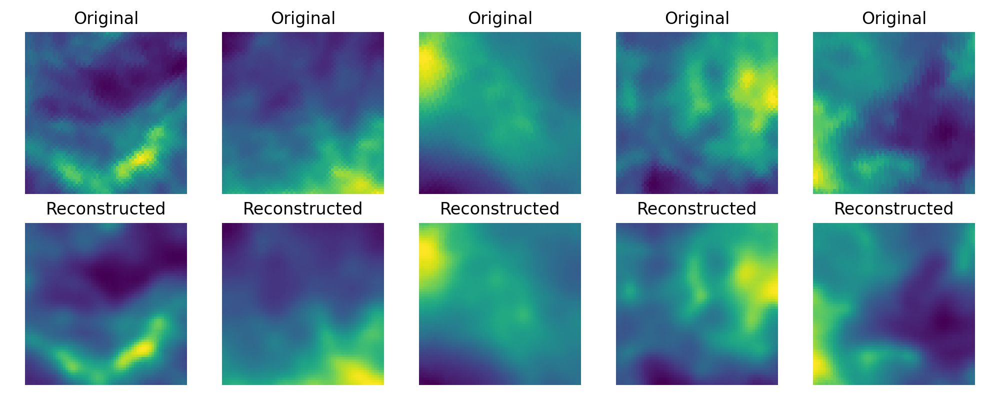
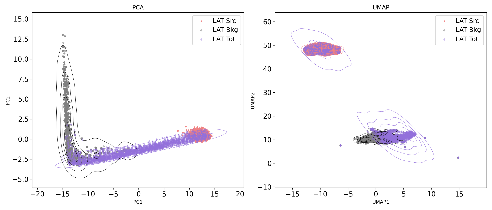

# BachelorThesis-Fermi-LAT

This repository contains codes and images produced during the preparation of bachelor thesis. Below is a short summary of each step:

1. Using 10 years Fermi-LAT simulated data, and focusing only on 1-2 GeV energy bin, we explore the latent space of a Convolutional Autoencoder network that was trained to reconstruct Fermi-LAT background gamma-rays, which in our case is a combination of Diffuse Interstellar Emission and Isotropic Background. Example of background reconstruction is shown below:

2. While passing source-only images through this network, first we see a separate cluster in the PCA space; Then the total images (background + source-only) formed a continuum between the source and background cluster. This is shown in figure:

   

3. We then further inspect the top 5 total images where their background counterparts lie closest (farthest) to the background cluster in this PCA space, and show that indeed they are background (source) dominated (in terms of photon counts). This is shown in Figure below. 

_Shortest Distance (background dominated)_
 

_Longest Distance (source dominated)_

